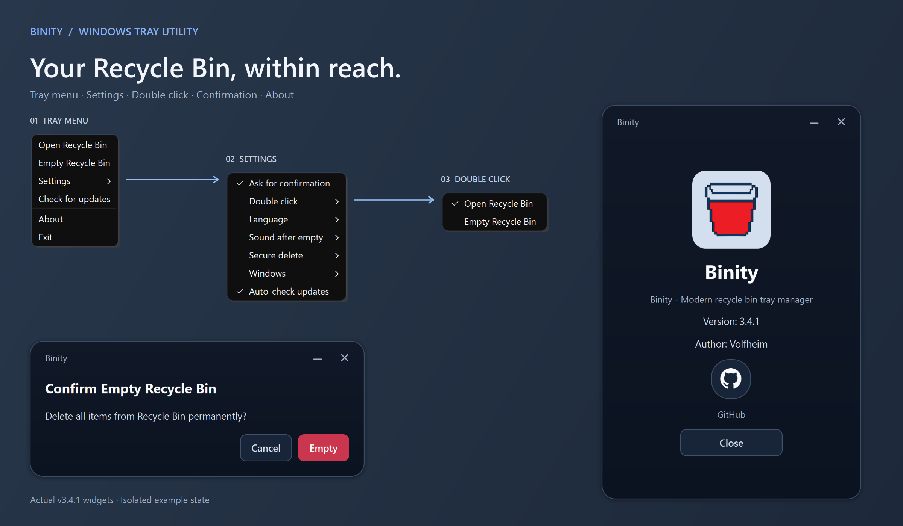

<div align="center">

# Binity

### Your Recycle Bin, within reach.

A small Windows tray utility to see, open, and empty your Recycle Bin.

**English** · [Русский](README.ru.md)

[**Download Binity**](https://github.com/Volfheim/Binity/releases/latest) · [Release notes](https://github.com/Volfheim/Binity/releases) · [Report an issue](https://github.com/Volfheim/Binity/issues)

**Windows 10 (1809+) / 11 · x64 release · Python + PyQt6**

</div>



<sub>Real v3.3.9 Qt widgets rendered from source with isolated example settings, arranged together for this overview. Native menu appearance can vary with Windows. No files were deleted to make this image.</sub>

## Small icon. Everyday control.

Keep the Recycle Bin one click away while your desktop stays clear. Binity lives in the notification area, shows its size on hover, and lets you decide when to empty it.

| At a glance | On your terms |
| --- | --- |
| **Five icon states** based on file count and total size | **Confirm before emptying**, enabled by default |
| **Open or empty** from the tray menu | **Choose the double-click action**: open or empty |
| **Overflow notifications** when the configured size threshold is reached | **Windows startup and theme sync** options |
| **English and Russian** interface | **Four sound choices**: silent, Windows, paper crumple, or throw in trash |
| **Built-in update checks** and an installation prompt in the EXE build | **Optional one-pass overwrite** with zeros or random data |

The five icons are occupancy levels, not a percentage of disk capacity. Overflow notifications use a 15 GB threshold by default and are reminders; **Binity does not empty the bin automatically**.

## Get started

1. Download **`Binity.exe`** from the [latest release](https://github.com/Volfheim/Binity/releases/latest) and keep it in a folder where you want to run it. No installer or separate Python installation is needed.
2. Launch it and find the bin icon in the Windows notification area; it may be under **Show hidden icons**. Binity has a tray menu rather than a main window.
3. Right-click for actions and settings. The initial language is Russian: choose **Настройки → Язык → Английский** to switch to English. Double-click opens the Recycle Bin by default.

To run it at sign-in, enable **Settings → Windows → Run with Windows**. Keep the EXE at that location after enabling startup.

## Before you empty the bin

Normal emptying uses the Windows Recycle Bin operation. Confirmation is enabled by default; emptying applies to the bin, not a selected file.

**Secure delete is best effort.** The optional modes attempt to overwrite accessible Recycle Bin file contents once before normal emptying. Locked or inaccessible files may not be overwritten. SSD/NVMe wear leveling, snapshots, and backups can preserve other copies, so this is not a guarantee of irrecoverability or a replacement for device sanitization. Overwriting also increases disk activity and takes longer.

## Settings and updates

- Settings: `%APPDATA%\Binity\settings.json`. Existing supported legacy settings are imported on first launch.
- Crash log, if an unhandled error occurs: `%LOCALAPPDATA%\Binity\crash.log`.
- Update staging and diagnostics: `%LOCALAPPDATA%\Binity\updates\`.
- Packaged builds check GitHub Releases at launch and periodically; downloads and installation require an update prompt to be accepted. A manual check is available in the tray menu. The startup check runs even if background auto-checks are disabled in the current version.
- Download checks validate size, the EXE header, and the GitHub-provided SHA-256 digest when the release API provides one; this is still not publisher-signature verification.

## Run from source

Use **Windows 10 version 1809 or newer, Windows 11, and Python 3.10+**. The current Qt 6 build is x64; Windows 7, Windows 8.1, 32-bit Windows, and ARM64EC are not supported by this release. The pinned build below was verified on **Windows 11 x64 with CPython 3.13.3**.

```powershell
git clone https://github.com/Volfheim/Binity.git
cd Binity
py -3 -m venv .venv
.\.venv\Scripts\python.exe -m pip install -r requirements.txt
.\.venv\Scripts\python.exe main.py
```

Running from source starts the real tray utility. Settings are stored in the paths above.

## Test and build

From the repository root, install the pinned build dependencies into a fresh virtual environment, then run the tests and build:

```powershell
py -3.13 -m venv .venv
.\.venv\Scripts\python.exe -m pip install -r requirements-build.txt
.\.venv\Scripts\python.exe -m unittest discover -s tests -v
.\.venv\Scripts\python.exe -m PyInstaller --clean --noconfirm Binity.spec
```

The result is **`dist\Binity.exe`**, with icons, both WAV sounds, and Windows version metadata included. This is a local unsigned build; the spec does not publish releases, access credentials, or change versions. Matching dependencies make the process repeatable, but byte-identical EXEs are not promised.

The tests use temporary settings and controlled OS/network boundaries. They cover settings recovery, tray levels, autostart command parsing, updater behavior, and sound assets without emptying your Recycle Bin. They do not replace a live Windows integration check of deletion or updating.

`release_helper.py` is a maintainer publishing tool with external side effects. Use the spec above for local builds.

## Feedback and license

For bugs, include your Windows version, Binity version, steps to reproduce, and the relevant log excerpt in [Issues](https://github.com/Volfheim/Binity/issues). Remove personal paths and data before sharing logs.

By **[Volfheim](https://github.com/Volfheim)**. Inspired by **MiniBin**, by Mike Edward Moras; Binity is a separate implementation using Python, PyQt6, and Windows APIs.

Licensed under the [Volfheim Non-Commercial License v1.0](LICENSE). Personal, non-commercial use is permitted; commercial use, modification, and redistribution require the author's prior written permission. See the full license for its terms.
