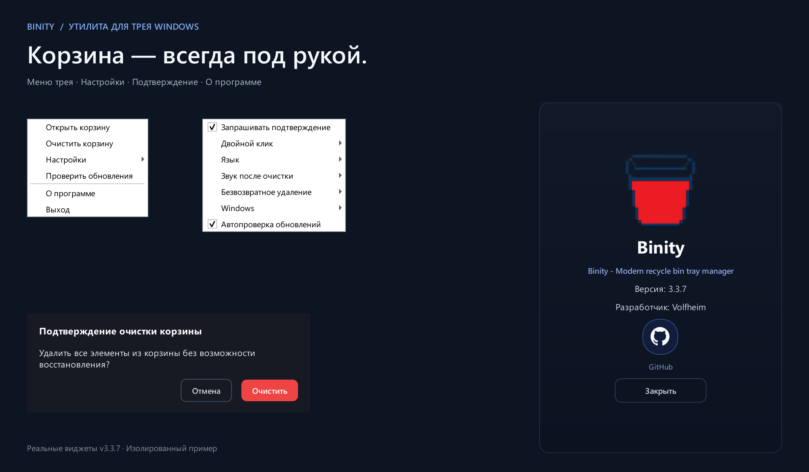

<div align="center">

# Binity

### Корзина — всегда под рукой.

Небольшая утилита для просмотра, открытия и очистки корзины Windows из трея.

[English](README.md) · **Русский**

[**Скачать Binity**](https://github.com/Volfheim/Binity/releases/latest) · [История версий](https://github.com/Volfheim/Binity/releases) · [Сообщить об ошибке](https://github.com/Volfheim/Binity/issues)

**Windows 10 (1809+) / 11 · релиз x64 · Python + PyQt6**

</div>



<sub>Реальные Qt-виджеты v3.3.8, отрисованные из исходников с изолированными настройками и собранные в один обзор. Вид системного меню может зависеть от Windows. Для этого изображения файлы не удалялись.</sub>

## Маленькая иконка. Всё нужное рядом.

Корзина доступна из области уведомлений, даже если рабочий стол скрыт окнами. Наведите курсор, чтобы увидеть её размер, или откройте меню и решите, когда очистить содержимое.

| Сразу видно | Легко настроить |
| --- | --- |
| **Пять состояний иконки** по числу файлов и общему размеру | **Подтверждение очистки**, включённое по умолчанию |
| **Открытие и очистка** через меню трея | **Действие двойного клика**: открыть или очистить |
| **Уведомление о переполнении** при достижении заданного порога | **Запуск с Windows и синхронизация темы** |
| **Русский и английский** интерфейс | **Четыре варианта звука**: без звука, системный, сминание бумаги и бросок в корзину |
| **Проверка обновлений** с предложением установки в EXE-сборке | **Необязательная перезапись в один проход** нулями или случайными данными |

Состояния иконки отражают уровень заполнения, а не процент ёмкости диска. Порог уведомления по умолчанию — 15 ГБ. Это напоминание: **Binity не очищает корзину автоматически**.

## Начало работы

1. Скачайте **`Binity.exe`** из [последнего релиза](https://github.com/Volfheim/Binity/releases/latest) и сохраните в папку, откуда будете его запускать. Установщик и отдельная установка Python не нужны.
2. Запустите программу и найдите иконку корзины в области уведомлений Windows; она может быть среди скрытых значков. Главное управление находится в меню трея, отдельного главного окна нет.
3. Правая кнопка открывает действия и настройки. По умолчанию выбран русский язык, а двойной клик открывает корзину.

Для запуска при входе в систему включите **Настройки → Windows → Запускать с Windows**. После этого оставьте EXE по выбранному пути.

## Перед очисткой

Обычная очистка использует операцию корзины Windows. Подтверждение включено по умолчанию; действие применяется к корзине, а не к отдельно выбранному файлу.

**Secure delete работает по принципу best effort.** Дополнительные режимы пытаются один раз перезаписать содержимое доступных файлов корзины перед обычной очисткой. Заблокированные или недоступные файлы могут остаться без перезаписи. Wear leveling на SSD/NVMe, снимки и резервные копии могут сохранять другие экземпляры данных, поэтому это не гарантия невозможности восстановления и не замена процедуре очистки всего накопителя. Перезапись также увеличивает нагрузку на диск и время операции.

## Настройки и обновления

- Настройки: `%APPDATA%\Binity\settings.json`. Поддерживаемые старые настройки импортируются при первом запуске.
- Журнал необработанных ошибок: `%LOCALAPPDATA%\Binity\crash.log`.
- Временные файлы и диагностика обновлений: `%LOCALAPPDATA%\Binity\updates\`.
- EXE-сборка проверяет GitHub Releases при запуске и затем периодически. Для скачивания и установки нужно принять предложение обновления. Ручная проверка доступна в меню трея. В текущей версии проверка при запуске выполняется и при отключённой фоновой автопроверке.
- Загрузка проверяется по размеру, заголовку EXE и SHA-256 digest из GitHub API, если релиз его предоставляет; это всё равно не проверка цифровой подписи издателя.

## Запуск из исходников

Нужны **Windows 10 версии 1809 или новее, Windows 11 и Python 3.10+**. Текущая сборка Qt 6 рассчитана на x64; Windows 7, Windows 8.1, 32-битная Windows и ARM64EC этим релизом не поддерживаются. Описанная ниже сборка с фиксированными зависимостями проверена на **Windows 11 x64 и CPython 3.13.3**.

```powershell
git clone https://github.com/Volfheim/Binity.git
cd Binity
py -3 -m venv .venv
.\.venv\Scripts\python.exe -m pip install -r requirements.txt
.\.venv\Scripts\python.exe main.py
```

Команда запускает настоящую утилиту в трее. Настройки сохраняются по указанным выше путям.

## Проверка и сборка

В корне репозитория установите фиксированные зависимости в новое виртуальное окружение, выполните тесты и соберите EXE:

```powershell
py -3.13 -m venv .venv
.\.venv\Scripts\python.exe -m pip install -r requirements-build.txt
.\.venv\Scripts\python.exe -m unittest discover -s tests -v
.\.venv\Scripts\python.exe -m PyInstaller --clean --noconfirm Binity.spec
```

Результат — **`dist\Binity.exe`** с иконками, обоими WAV-файлами и метаданными версии Windows. Это локальная сборка без цифровой подписи; spec не публикует релизы, не обращается к credentials и не меняет версии. Фиксированные зависимости позволяют повторить процесс, но побайтовое совпадение EXE не обещается.

Тесты используют временные настройки и изолированные обращения к ОС и сети. Они проверяют восстановление настроек, уровни иконки, разбор команды автозапуска, обновлятор и звуковые ресурсы, не очищая вашу корзину. Это не замена проверке реального удаления и установки обновления в Windows.

`release_helper.py` — инструмент публикации для сопровождающего с внешними побочными действиями. Для локальной сборки используйте spec выше.

## Обратная связь и лицензия

В [Issues](https://github.com/Volfheim/Binity/issues) укажите версии Windows и Binity, шаги воспроизведения и нужный фрагмент журнала. Перед отправкой удалите личные пути и данные.

Автор — **[Volfheim](https://github.com/Volfheim)**. Источником вдохновения стала **MiniBin** от Mike Edward Moras; Binity — отдельная реализация на Python, PyQt6 и Windows API.

Действует [Volfheim Non-Commercial License v1.0](LICENSE). Разрешено личное некоммерческое использование; коммерческое использование, изменение и распространение требуют предварительного письменного разрешения автора. Полные условия приведены в лицензии.
